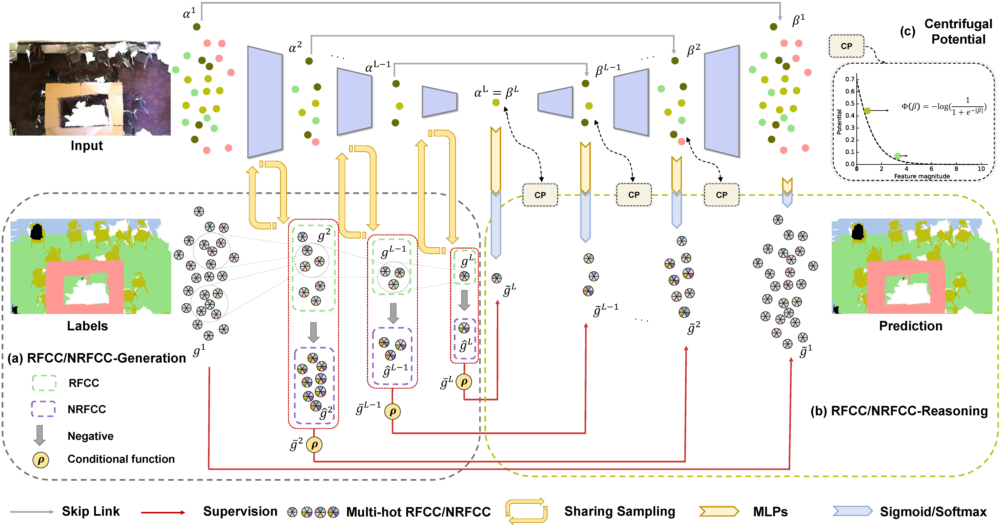

# RFCR-NL: Positive-Negative Receptive Field Reasoning for Omni-supervised 3D Segmentation (TPAMI 2023)
This is the official implementation of RFCR-NL (TPAMI 2023), which is the extension work of RFCR (CVPR 2021) and utilized negative learning for both fully supervised and weakly supervised point cloud segmentation. For technical details, please refer to:

**Positive-Negative Receptive Field Reasoning for Omni-supervised 3D Segmentation (TPAMI 2023)**

Xin Tan*, Qihang Ma*, Jingyu Gong, Jiachen Xu, Zhizhong Zhang, Haichuan Song, Yanyun Qu, Yuan Xie, and Lizhuang Ma.

**[Paper(coming soon)]**

**Omni-supervised Point Cloud Segmentation via Gradual Receptive Field Component Reasoning (CVPR 2021)**

Jingyu Gong, Jiachen Xu, Xin Tan, Haichuan Song, Yanyun Qu, Yuan Xie*, Lizhuang Ma*.

**[[Paper](https://arxiv.org/pdf/2105.10203.pdf)] [[Code](https://github.com/azuki-miho/RFCR)]**



## News
- Code will coming soon.
- :star2:`[2023/9/23]` RFCR-NL was accepted to TPAMI 2023.
  
### Getting Started

comming soon

## Acknowledgement

Many thanks to these excellent open source projects:
- [RandLA-Net](https://github.com/QingyongHu/RandLA-Net/), [KPConv](https://github.com/HuguesTHOMAS/KPConv).


## BibTex
If this work is helpful for your research, please consider citing:
```
@article{Tan_2023_TPAMI_point,
    author = {Tan, Xin and Ma, Qihang and Gong, Jingyu and Zhang, Zhizhong and Song, Haichuan and Qu, Yanyun and Xie, Yuan and Ma, Lizhuang},
    title = {Positive-Negative Receptive Field Reasoning for Omni-supervised 3D Segmentation},
    journal={IEEE Transactions on Pattern Analysis and Machine Intelligence},
    year = {2023},
    doi={10.1109/TPAMI.2023.3319470}
}
@inproceedings{gong2021omni,
  title={Omni-supervised point cloud segmentation via gradual receptive field component reasoning},
  author={Gong, Jingyu and Xu, Jiachen and Tan, Xin and Song, Haichuan and Qu, Yanyun and Xie, Yuan and Ma, Lizhuang},
  booktitle={Proceedings of the IEEE/CVF conference on computer vision and pattern recognition},
  pages={11673--11682},
  year={2021}
}
```